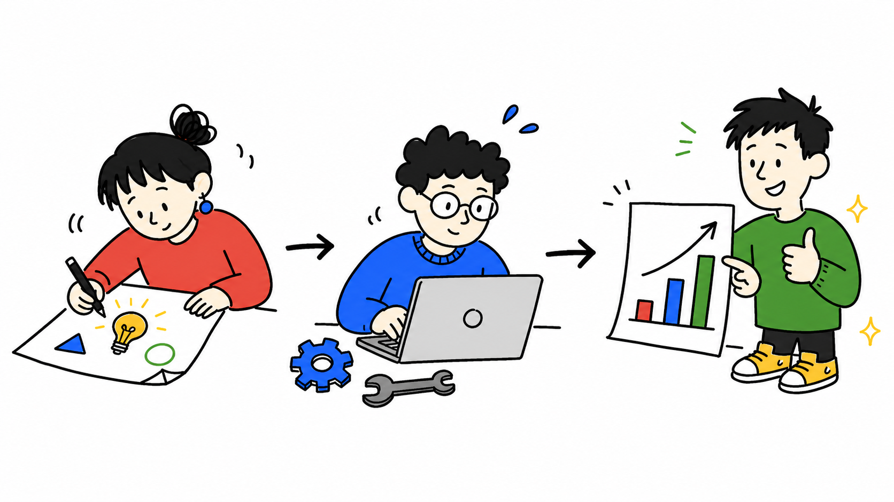
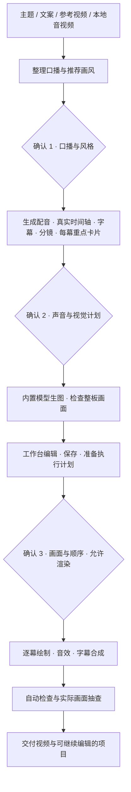
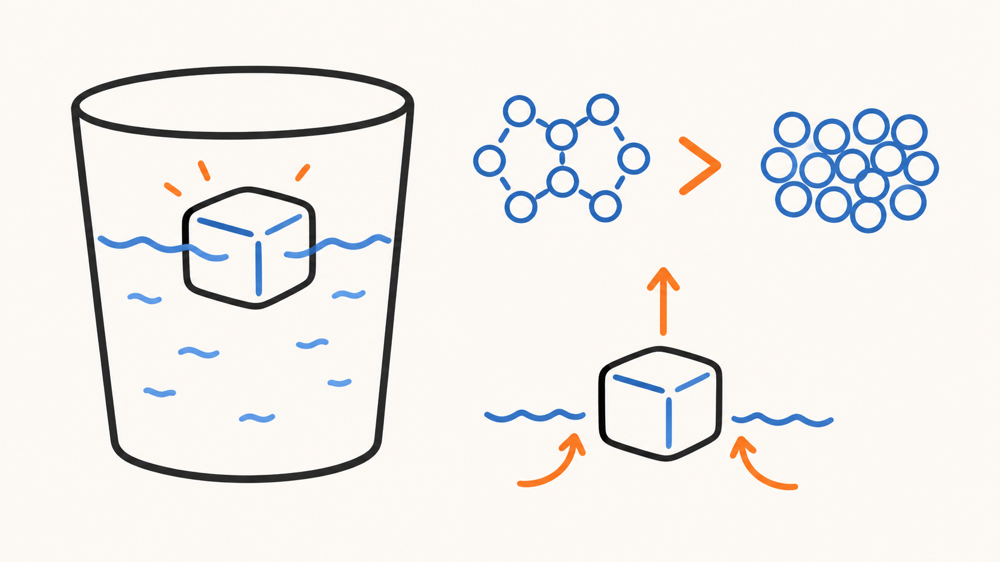
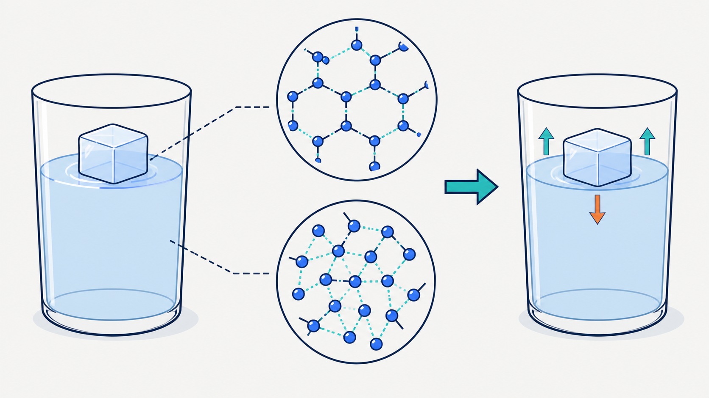
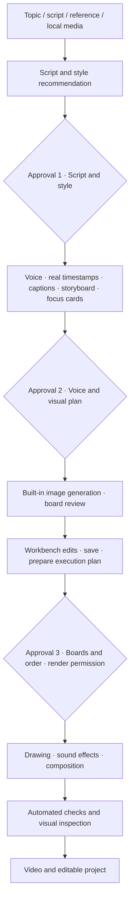

# SketchNarrator

### 把一个想法，讲成一支手绘视频。

**中文口播 · 十种画风 · 逐对象绘制 · 真实音频节奏 · 三次确认**

[中文](#中文) · [English](#english) · [十种风格](#styles-zh) · [开始使用](#install-zh)



<a id="中文"></a>

SketchNarrator 是一个把主题、文案或参考视频转成**中文手绘讲解视频**的 Agent Skill。你提出想法、选择画风、确认关键内容；Agent 完成口播、配音、字幕、分镜、生图、绘制动画、音效与合成。

适合科普知识、产品解释、教学内容、人物故事和系列短视频。内置渲染器随 Skill 一起提供，无需再搭建一套视频工程。

> **直接使用 Agent 工具内置的生图模型，无需另接图片 API。** 默认 Edge 配音也无需配置语音 API Key。宿主的订阅、额度与使用权限仍适用；本流程不等于完全离线。

## 为什么选择 SketchNarrator

| 特色 | 带来的体验 |
| --- | --- |
| **从想法到成片** | 主题、成稿、链接或本地音视频都可以作为起点，Agent 负责衔接制作步骤。 |
| **声音决定节奏** | 用实际配音和逐词时间安排字幕、对象出现与转场，不按字数平均切画面。 |
| **画面跟着解释展开** | 每幕围绕一个核心意思，先画识别特征与动作，再上基础色、补润色。 |
| **十种视觉语言** | 根据主题推荐风格，也可以直接指定；同一参考图贯穿生图与画面检查。 |
| **关键决定由你掌握** | 三次创作确认，让改稿、换声音、调画面发生在合适阶段。 |
| **每幕重点一眼可见** | 可选左上角文字卡片在分镜阶段设计，并与声音和视觉计划一起确认；它不占用生图额度。 |
| **可编辑的本地工作台** | 拖动、缩放、增删、排序，逐幕撤销与重做；编辑保存与生产检查分开。 |
| **有声音的手绘过程** | 内置书写、擦除、换幕、强调、结论音效，低音量配合动作，旁白优先。 |
| **失败不会推倒重来** | 分镜问题一次列全；配置在绘制前检查；每幕完成后立即留下可核对的渲染缓存。 |
| **可继续的项目** | 保留稿件、音频、图片、标注和批准计划，修改一幕时只重做对应部分。 |

## 从输入到成片，只需三次创作确认



| 你确认什么 | Agent 已准备什么 | 确认后做什么 |
| --- | --- | --- |
| **① 口播与风格** | 完整文案、推荐画风与理由 | 生成正式声音并取得真实时间 |
| **② 声音与视觉计划** | 配音试听、字幕、分镜、每幕重点卡片与中文视觉编排表 | 生成整板图并制作标注 |
| **③ 画面与绘制顺序** | 工作台画面、编辑结果、有效执行计划 | 按批准版本正式渲染 |

每个确认点都可以提出修改。保存不等于批准，准备计划也不增加第四次确认；内部 QA 由 Agent 执行。参考范围、额外付费服务或依赖安装授权是独立的使用选择，不冒充创作确认。

## 参考视频，可以参考到画面与节奏

- **只参考口播**：提取字幕或音轨，围绕观点、知识和表达组织原创稿件。
- **完整参考**：额外分析关键帧、镜头、构图、画面运动、字幕、节奏与转场，再转换成原创手绘表达。

你可以直接说明“只参考口播”或“也参考镜头和节奏”。完整参考会增加下载与分析时间；分析器只顺序解码一次，以最高 4Hz、最多 4800 个运动样本检测镜头，再抽取最多 20 张关键帧，避免对压缩视频反复随机跳转。Agent 仍需实际查看画面，不能只读字幕就声称完成视觉分析。

<a id="styles-zh"></a>

## 十种风格，先看再选

以下是仓库内实际使用的风格参考图，点击可查看原图。它们展示视觉方向，不是十支已经验收的成片；最终内容由你的主题与分镜决定。

| | |
| :---: | :---: |
| **01 · 暖米黄素描白板**<br><br>温暖的日常科普与生活知识<br>`warm-pencil` | **02 · 极简粗线简笔白板**<br><br>用清楚的轮廓解释一个概念<br>`minimal-whiteboard` |
| **03 · 规整彩线手绘**<br><br>彩色讲解、教程与整齐的信息组织<br>`orderly-color-doodle` | **04 · 极简商务涂鸦**<br><br>产品、商业与工作方法<br>`business-doodle` |
| **05 · 深墨绿粉笔黑板**<br><br>课堂感、原理与推导<br>`dark-chalkboard` | **06 · 粗线扁平国风卡通**<br><br>文化、历史与国风叙事<br>`guofeng-flat` |
| **07 · 漫画墨线解释**<br><br>人物故事、动作与情绪<br>`comic-ink` | **08 · 纸感隐喻拼贴**<br><br>抽象概念与视觉隐喻<br>`paper-metaphor-collage` |
| **09 · 复古报纸拼贴**<br><br>历史回顾与编辑式叙事<br>`retro-newspaper` | **10 · 黑金科技发布会**<br><br>科技概念与发布式表达<br>`black-gold-tech` |


## 工作台：把画面调整到你满意

工作台运行在本机浏览器中，Agent 会给出当前项目的实际访问链接。你可以：

- 自由拖拽、放大、缩小、新增、删除和排序标注框，包括删除全部框。
- 调整对象时序与相关画面参数，播放、暂停和拖动时间轴。
- 按幕撤销或重做误操作；保存不会清空当前有效的编辑历史。
- 先看即时代理播放，再按需生成当前幕的真实渲染预览。

**编辑先保存，能否生产另行检查。** 重叠、越界、空框等编辑不会因画面质量问题被拒绝保存；真正写盘失败会提示失败，版本冲突会保留冲突副本。第三次确认会直接展示整板图、实际绘制预览和需要注意的位置；你确认渲染后，画面质量提醒不会再次拦住执行。代理播放不代表最终笔迹效果；撤销历史受浏览器存储和项目版本约束。

## 配音与音效，让画面有自己的节奏

默认使用 **Edge 中文配音**，无需额外语音密钥。字幕与绘制时间以实际音频为准。需要其他声音时，可选 Azure Speech、ElevenLabs、Piper、Sherpa-ONNX 或已有 VoiceStudio 服务，只有明确选择后才准备相应依赖与配置。

内置 **Classic Light** 音效预设，使用已记录来源的 CC0 素材：

| 音效 | 配合的动作 | 素材 |
| --- | --- | --- |
| 书写声 | 真实落笔和绘制时段 | [试听](assets/sfx/classic-light/writing-pencil.wav) |
| 擦除声 | 板擦经过画面 | [试听](assets/sfx/classic-light/eraser-rub.wav) |
| 换幕声 | 场景过渡 | [试听](assets/sfx/classic-light/transition-whoosh.wav) |
| 强调声 | 有语义依据的重点揭示 | [试听](assets/sfx/classic-light/emphasis-pop.wav) |
| 结论提示 | 结论出现 | [试听](assets/sfx/classic-light/conclusion-chime.wav) |

音效跟随实际计划安排，不随机堆叠、不延长旁白时间。你可以要求关闭音效，也可以使用自己有权使用的本地素材。关闭音效时不会读取外部音效配置；外部设置只配置字体或角色时，仍可正常使用公开默认音效。来源和许可见 [第三方说明](THIRD_PARTY_NOTICES.md)。

<a id="install-zh"></a>

## 开始使用

### 1. 选择你的 Agent 工具

面向 **Codex、Antigravity、WorkBuddy、豆包办公**等具备本地代理能力的工具使用。同一套 Skill，不需要为每个工具另接图片 API。

除了内置生图模型，当前会话还需要**读写本地文件、执行命令、查看图片和访问本机浏览器**。仅有聊天或生图入口的界面不足以独立运行完整流程；各产品版本和账号能力以实际工具为准，列出名称不代表所有版本都已完成端到端验证。

### 2. 导入完整 Skill

把本仓库地址或解压后的完整目录交给 Agent：

> 安装这个仓库的完整 sketch-narrator Skill，保留 scripts、renderer、references 和 assets。请先检查所需环境，再完成已授权的安装准备。

按宿主自己的 Skill 导入方式安装，目录名使用 `sketch-narrator`，不要只上传 `SKILL.md`。Codex 可使用 `skill-installer`；其他工具使用各自的完整目录导入方式。`renderer/` 是内部组件，无需第二次安装。

### 3. 提出你的第一个需求

> 使用 sketch-narrator，制作一期“为什么冰会浮在水面上”的中文科普短视频。先给我口播稿和画风建议。

也可以提供已写好的文案、参考链接或本地音视频，并指定受众、预计时长、画幅、风格及参考范围。后续由 Agent 执行工作流，你只需提出修改并完成关键确认。

## 所需环境与安装检查

| 项目 | 要求与处理方式 |
| --- | --- |
| Python | **3.10+**，具备 `venv` 与 `pip`；不预设新版上限，没有可用解释器时明确提示。 |
| 核心依赖 | PyAV、NumPy、OpenCV、Pillow、Edge TTS，由启动器在 `renderer/.venv` 中准备。 |
| FFmpeg | 检查系统及隔离环境；缺失时，在授权范围内安装并检查实际编码能力，不修改系统 PATH。 |
| 中文字体 | 可用的中文字形，推荐 Noto Sans CJK SC 或 Source Han Sans SC；也可指定本地字体。 |
| 文件与浏览器 | 运行目录与项目目录可写；本机浏览器启用 JavaScript 和 Cookie。项目放在 Skill 目录之外。 |
| 网络 | 首次依赖下载、默认 Edge 配音及宿主生图需要相应网络能力；参考下载和可选模型按需求联网。 |

<details>
<summary>Agent / 开发者使用的检查与维护入口</summary>

用户无需手动执行；以下供宿主代理和开发者排障。

```powershell
scripts\run.cmd doctor --host workbuddy --project "<项目目录>"
scripts\run.cmd setup --install-ffmpeg
scripts\run.cmd setup --upgrade
```

```bash
sh scripts/run.sh doctor --host antigravity --project "<project-directory>"
sh scripts/run.sh setup --install-ffmpeg
sh scripts/run.sh setup --upgrade
```

`doctor` 不安装依赖、不访问在线服务；它报告解释器、依赖、字体、FFmpeg 和权限预检。宿主能力声明不等于实际运行验证，目录权限估计不等于已经成功写盘。

`setup --install-ffmpeg` 仅在已有安装授权时执行；没有授权才询问。新环境按 Python 与平台解析可用依赖版本，现有环境默认复用，`setup --upgrade` 才明确请求升级。最低版本与依赖见 [pyproject.toml](pyproject.toml)。安装检查不替代实际成片验收。

可用 `SKETCHNARRATOR_BOOTSTRAP_PYTHON` 指定解释器、`SKETCHNARRATOR_FONT` 指定字体。macOS/Linux 使用 `sh scripts/run.sh`，不依赖压缩包保留可执行位。

</details>

## 输出、隐私与许可

交付包含最终视频和可继续处理的项目资料，如口播、配音、字幕、板图、标注、计划及 QA 记录。生成文件不等于验收通过；自动检查与实际画面抽查完成后才交付通过验收的成片。

- **默认不需要额外图片或语音 API Key**，但生图遵循宿主的模型和额度；Edge 会把送读文本发往微软在线语音服务。
- 可选云配音、参考下载和首次模型下载会访问相应服务，详见 [安全与网络说明](SECURITY.md)。完整流程不承诺离线。
- 私人角色、品牌素材、私有音效、字体路径和固定片头片尾通过外部本机配置接入，不随公开包分发。
- 工作台默认仅本机访问；显式开启局域网模式后使用 HTTP，不提供传输加密。
- 自有代码与明确标注的第一方素材使用 [MIT License](LICENSE)；第三方代码、CC0 音效及运行依赖保留各自许可，见 [THIRD_PARTY_NOTICES](THIRD_PARTY_NOTICES.md)。

## 文档与参与

| 文档 | 内容 |
| --- | --- |
| [SKILL.md](SKILL.md) | Agent 执行入口与确认流程 |
| [编辑与执行契约](references/timing-and-recovery.md) | 保存、撤销、批准、像素和时间预算 |
| [视觉制作](references/visual-production.md) | 画面与手绘动画规范 |
| [配音选择](references/free-tts.md) | 可选声音与离线模型准备 |
| [贡献指南](CONTRIBUTING.md) | 开发与验证要求 |
| [发布清单](release-manifest.json) | 公开文件集合 |
| [本机配置示例](references/local-settings.example.json) | 可选音效、Presenter 与片头片尾配置结构 |

公开包由 `python scripts/package_release.py` 按发布清单确定性构建，ZIP 内包含顶层 `sketch-narrator/` 目录和清单自身。不要直接压缩包含环境、缓存或私人项目的开发目录。最新依赖与各宿主组合需要实际验证，不能仅凭安装成功宣称兼容。

---

<a id="english"></a>

## SketchNarrator · English

### Turn an idea into a hand-drawn explainer.

**Chinese narration · 10 visual styles · Object-by-object drawing · Audio-driven timing · 3 approvals**

SketchNarrator is an Agent Skill for producing **Chinese hand-drawn explainer videos** from a topic, script, reference video or local media. You shape the message and approve key decisions; the agent handles narration, voice, captions, storyboards, image generation, drawing animation, sound effects and composition.

It is designed for science explainers, lessons, product explanations, stories and recurring short-video series. The renderer is bundled with the Skill.

**Use your agent's built-in image model. No separate image API integration is required.** Default Edge narration also needs no speech API key. Your host's subscriptions, quotas and permissions still apply; this is not an entirely offline workflow.

### What makes it useful

| Feature | What it gives you |
| --- | --- |
| Idea-to-video workflow | Start with a topic, script, link or local media and let the agent connect the production steps. |
| Real audio timing | Narration and word timestamps drive captions, reveals and transitions. |
| Drawing that explains | Complete recognition and action lines, add base color, then optional polish for each object. |
| Ten visual styles | Pick a reference or let the agent recommend one for your topic. |
| Three creative approvals | Review the script, then the voice and plan, then the board and drawing order. |
| Per-scene focus cards | Plan an optional top-left focus label with each scene and approve it with the voice and visual plan, without spending image-generation quota. |
| Editable local workbench | Move, resize, add, remove and reorder regions, with per-scene undo and redo. |
| Built-in sound design | Writing, erasing, transitions, emphasis and conclusion cues keep narration in focus. |
| Fail without restarting | Storyboard issues are reported together, configuration is checked before drawing, and each completed scene is cached immediately. |
| Resumable projects | Keep source materials and the approved plan; change one scene and rebuild only that part. |

### Workflow



| Approval | What you review | What happens next |
| --- | --- | --- |
| 1 | Full script, style recommendation and rationale | Generate narration and measure its timing |
| 2 | Voice sample, captions, storyboard, per-scene focus cards and visual plan | Generate and annotate boards |
| 3 | Workbench edits and the current execution plan | Render the approved version |

Saving is not approval. Preparing a plan does not introduce a fourth approval. Internal QA is handled by the agent. Reference scope, installation permissions and optional paid services are separate choices.

For reference videos, choose **script-only** or **full visual reference**. Full reference decodes the video once in sequence, samples motion at up to 4 Hz with a 4,800-sample cap, and extracts at most 20 keyframes. The agent then inspects the actual frames, composition, motion, pacing and transitions before adapting the ideas into original hand-drawn scenes.

### Ten visual styles

These are the actual bundled style references, not ten validated finished videos. Click an image to inspect it; the subject and composition come from your own project.

| | |
| :---: | :---: |
| **01 · Warm Pencil**<br><br>Everyday science and warm storytelling<br>`warm-pencil` | **02 · Minimal Whiteboard**<br><br>Clear concepts with bold outlines<br>`minimal-whiteboard` |
| **03 · Orderly Color Doodle**<br><br>Colorful tutorials and organized explanations<br>`orderly-color-doodle` | **04 · Business Doodle**<br><br>Products, business and methods<br>`business-doodle` |
| **05 · Dark Chalkboard**<br><br>Lessons, mechanisms and reasoning<br>`dark-chalkboard` | **06 · Guofeng Flat Cartoon**<br><br>Culture, history and Chinese-inspired stories<br>`guofeng-flat` |
| **07 · Comic Ink**<br><br>Characters, action and emotion<br>`comic-ink` | **08 · Paper Metaphor Collage**<br><br>Abstract ideas and visual metaphors<br>`paper-metaphor-collage` |
| **09 · Retro Newspaper**<br><br>History and editorial storytelling<br>`retro-newspaper` | **10 · Black & Gold Tech**<br><br>Technology and presentation-style explanations<br>`black-gold-tech` |


### Your local workbench

Move, resize, add, delete and reorder regions, including deleting all of them. Adjust timing, play or scrub the timeline, and undo or redo changes per scene. Use the quick proxy player for editing and request a real single-scene render when needed.

**Save edits first; check production readiness separately.** Overlaps, out-of-bounds boxes and empty regions do not fail persistence on visual-quality grounds. Disk failures are reported and version conflicts retain a separate copy. Approval 3 shows the board, actual drawing preview and any highlighted risk directly. Once you approve rendering, visual-quality advisories do not block that approved plan. Proxy playback is not a final drawing preview; history depends on browser storage and project version.

### Voice and sound effects

Edge is the default Chinese voice provider and requires no API key. Optional providers include Azure Speech, ElevenLabs, Piper, Sherpa-ONNX and an existing VoiceStudio service. They are only configured when explicitly selected. Local voice providers may require model downloads and word alignment; see [voice options](references/free-tts.md).

The bundled **Classic Light** preset uses documented CC0 sounds:

| Cue | Purpose | Sample |
| --- | --- | --- |
| Pencil | Actual drawing windows | [Listen](assets/sfx/classic-light/writing-pencil.wav) |
| Eraser | Board erasing | [Listen](assets/sfx/classic-light/eraser-rub.wav) |
| Whoosh | Scene transitions | [Listen](assets/sfx/classic-light/transition-whoosh.wav) |
| Pop | Meaningful emphasis | [Listen](assets/sfx/classic-light/emphasis-pop.wav) |
| Chime | Conclusions | [Listen](assets/sfx/classic-light/conclusion-chime.wav) |

Cues follow the real plan, stay beneath narration and do not extend it. You can disable them or supply your own licensed local sounds. Disabling SFX bypasses local SFX settings, while a local settings file that configures only fonts or presenters leaves the bundled public preset available.

### Get started

Use **Codex, Antigravity, WorkBuddy, Doubao Office**, or another capable local agent. In addition to built-in image generation, the session needs local file access, command execution, image inspection and a localhost browser. A chat-only or image-only interface is not sufficient. Availability varies by product version and account; this list is not an end-to-end certification of every host.

1. Give the agent this repository URL or its complete extracted directory.
2. Ask it to install the full `sketch-narrator` Skill and check the environment. Keep `scripts`, `renderer`, `references` and `assets`; do not import only `SKILL.md`.
3. Use your host's Skill import method. Codex can use `skill-installer`; other hosts should use their own full-directory import flow.
4. Describe your first video, for example:

> Use sketch-narrator to create a short Chinese explainer about why ice floats. Start with the narration script and a recommended visual style.

You may specify audience, duration, aspect ratio, style and reference scope. The agent performs production; you provide direction and key approvals.

### Requirements

| Requirement | Preparation |
| --- | --- |
| Python 3.10+ | `venv` and `pip`; no speculative upper version cap. |
| Core packages | PyAV, NumPy, OpenCV, Pillow and Edge TTS in `renderer/.venv`. |
| FFmpeg | Detect system and isolated copies; install with authorization and check actual encoding. System PATH is unchanged. |
| Chinese font | A usable CJK font, such as Noto Sans CJK SC or Source Han Sans SC. |
| Files and browser | Writable runtime and project locations; JavaScript and cookies enabled. Keep projects outside the Skill directory. |
| Network | Package downloads, Edge narration and host image generation need their respective services. Optional references and models add downloads. |

The agent can run `scripts/run.cmd doctor --host workbuddy --project "<project-directory>"` on Windows, or `sh scripts/run.sh doctor --host antigravity --project "<project-directory>"` on macOS/Linux. This preflight installs nothing and contacts no online service. It distinguishes detected capabilities, permission estimates and host declarations.

`setup --install-ffmpeg` prepares FFmpeg with existing installation permission. `setup --upgrade` explicitly upgrades core and selected optional dependencies; normal use reuses the existing environment. The resolver selects versions compatible with Python and the platform. See [pyproject.toml](pyproject.toml); installation checks do not establish full video compatibility.

Use `SKETCHNARRATOR_BOOTSTRAP_PYTHON` for an explicit interpreter and `SKETCHNARRATOR_FONT` for a font. The POSIX launcher is invoked with `sh`, so ZIP extraction need not preserve executable permissions. Users do not need to manage these commands themselves.

### Outputs, privacy and licensing

Outputs include the video and retained project materials: script, audio, captions, boards, annotations, execution plan and QA records. A generated file is only accepted after automated checks and actual visual inspection.

- Built-in image generation follows the host's service and quota rules. Edge sends narration text to Microsoft's online speech service.
- Optional cloud voices, reference downloads and model preparation contact their respective services. See [SECURITY.md](SECURITY.md).
- Private characters, brand assets, audio presets, font paths and bookends are connected through external local configuration and excluded from the public package.
- The workbench defaults to loopback. Explicit LAN mode uses HTTP without transport encryption.
- Project code and explicitly identified first-party assets use the [MIT License](LICENSE). Third-party code, CC0 sounds and runtime dependencies retain their respective terms; see [THIRD_PARTY_NOTICES.md](THIRD_PARTY_NOTICES.md).

### Documentation and contributing

[Agent workflow](SKILL.md) · [Editing and execution contract](references/timing-and-recovery.md) · [Visual production](references/visual-production.md) · [Voice options](references/free-tts.md) · [Local settings example](references/local-settings.example.json) · [Contributing](CONTRIBUTING.md) · [Release manifest](release-manifest.json)

Run `python scripts/package_release.py` to build a deterministic ZIP from the manifest. The archive includes its own manifest under the top-level `sketch-narrator/` directory. Do not archive a development directory containing environments, caches or private projects. New host and dependency combinations require actual validation.

### 可选片头片尾的媒体探测 / Optional bookend probing

固定片头片尾优先使用 FFprobe；未安装时使用已有 PyAV 读取轨道、尺寸、帧率和时长，不需要另外安装 FFprobe。可通过 `WHITEBOARD_FFPROBE` 指定自己的可执行文件路径。缺少时长元数据时明确报告，不进行漫长的逐帧扫描。`doctor` 检查后端可用性，具体素材在准备时检查。

Optional intro/outro clips use FFprobe when available, otherwise the existing PyAV dependency reads stream metadata. Set `WHITEBOARD_FFPROBE` to select an executable. Missing duration metadata produces an actionable error rather than a full-frame scan. Doctor checks backend availability; preparation validates the actual clips.
